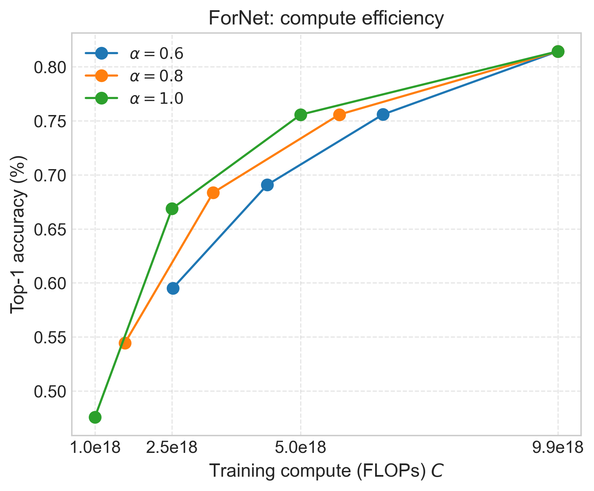
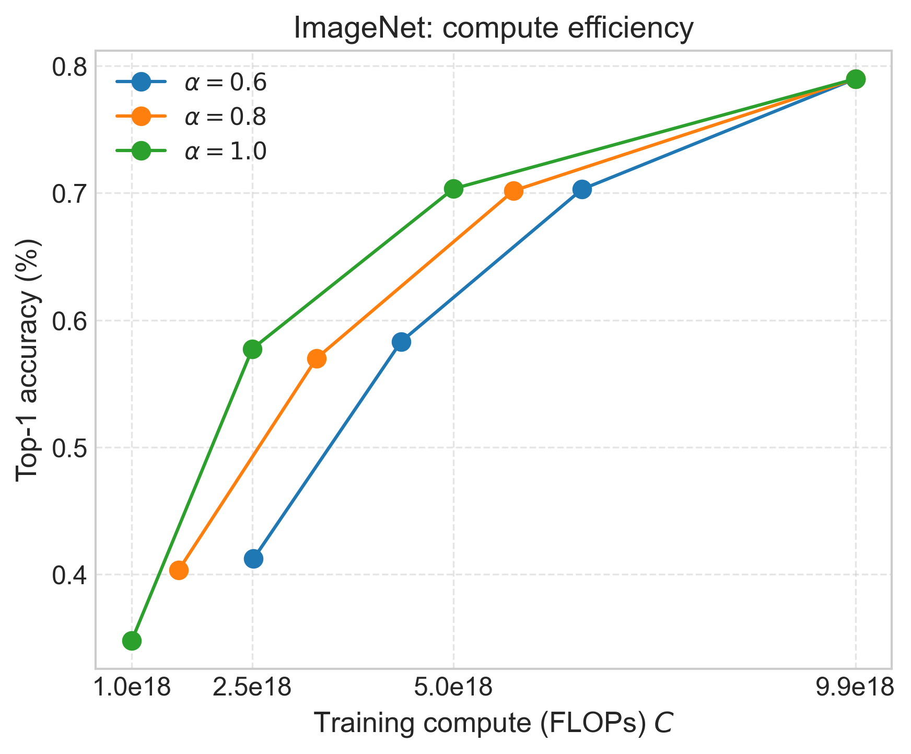

# Neural Scaling Lab 
Benchmarking and analysis pipeline for Vision Transformer (ViT) models on SLURM GPU clusters. Fetches experiment results of ViTs pretrained on ImageNet and ForNet datasets automatically using the Weights & Biases (W&B). Generates publication-ready graphs with Matplotlib.

---

### Compute Efficiency Comparison

  
  

---

## TODO

